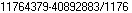

# PixelOCR
Simple Pixel-based OCR for black bitmap fonts on white background.
This takes 3 inputs.
- a B&W sample image.
- A B&W font in png format.  
    - no white pixels above nor below.
    - one white pixel column between characters.
    - one white pixel column at right edge of image.

- the characters of the font **0123456789-/**

This was built using this sample image.  

